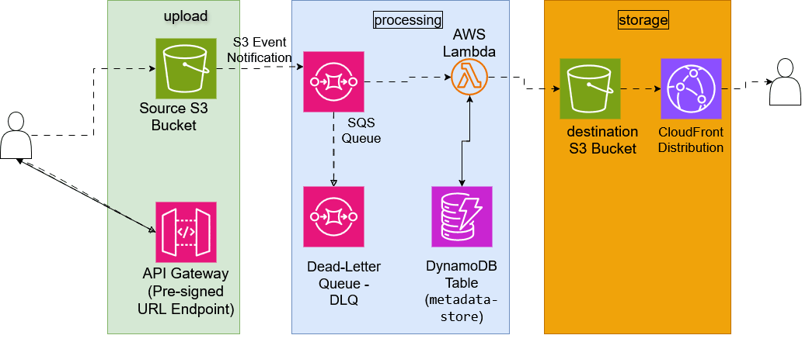

# Moaz-Fayez-aws-serverless-image-processing-pipeline
Serverless Image Processing Pipeline built with AWS S3, SQS, Lambda, DynamoDB, and CloudFront
# Serverless Image Processing Pipeline on AWS



## 📌 Executive Summary

This project implements a highly scalable, resilient, and event-driven **Serverless Image Processing Pipeline** built on Amazon Web Services (AWS). 

The architecture handles automated image uploads, queue-based decoupling, serverless processing (resizing and watermarking), metadata tracking, and low-latency global delivery. Designed using AWS best practices, it eliminates server management overhead, achieves near-zero idle cost, and ensures high availability.

---

## 🏗️ Architecture Overview

The system is decoupled into three logical phases: **Upload**, **Processing**, and **Storage & Delivery**.

1. **Upload Phase:**
   * **API Gateway:** Provides a secure REST endpoint for users to request pre-signed URLs.
   * **Source S3 Bucket (`raw-images-bucket`):** Users upload raw images directly to S3 via pre-signed URLs, bypassing server bottlenecks.
   * **S3 Event Notifications:** Emits an event upon object creation in the raw bucket.

2. **Processing Phase:**
   * **SQS Queue (`processing-queue`):** Buffers incoming event messages to decouple upload speed from backend processing.
   * **Dead-Letter Queue (DLQ):** Captures failed messages after unhandled processing retries for inspection and debugging.
   * **AWS Lambda (`image-processor-lambda`):** Polls the SQS queue, downloads the raw image, performs resizing and watermarking using Pillow/Sharp layers, and saves the output.
   * **DynamoDB Table (`metadata-store`):** Logs image processing metadata (filename, original/processed dimensions, execution time, and status).

3. **Storage & Delivery Phase:**
   * **Destination S3 Bucket (`processed-images-bucket`):** Stores final processed images with S3 Lifecycle policies enabled for cost optimization.
   * **Amazon CloudFront Distribution:** Serves processed images globally at edge locations with low latency and edge-caching.

---

## 🛠️ Key AWS Services Used

| AWS Service | Role in Architecture |
| :--- | :--- |
| **Amazon S3** | Object storage for raw uploads and processed image outputs |
| **Amazon API Gateway** | Provides secure endpoints for generating Pre-signed S3 Upload URLs |
| **Amazon SQS & DLQ** | Decouples components and provides fault-tolerant message queueing |
| **AWS Lambda** | Serverless compute execution for image manipulation |
| **Amazon DynamoDB** | Fast NoSQL storage for tracking image processing metadata |
| **Amazon CloudFront** | Global Content Delivery Network (CDN) for low-latency image delivery |

---

## 💻 Sample Lambda Code (`src/lambda_function.py`)

Below is a reference Python implementation for the AWS Lambda processing function:

```python
import json
import os
import urllib.parse
import boto3
from PIL import Image
import io

s3_client = boto3.client('s3')
dynamodb = boto3.resource('dynamodb')

DEST_BUCKET = os.environ.get('DEST_BUCKET_NAME', 'processed-images-bucket')
TABLE_NAME = os.environ.get('METADATA_TABLE_NAME', 'image-metadata')

def lambda_handler(event, context):
    table = dynamodb.Table(TABLE_NAME)
    
    for record in event['Records']:
        # Parse SQS message body containing S3 event
        body = json.loads(record['body'])
        if 'Records' not in body:
            continue
            
        for s3_record in body['Records']:
            source_bucket = s3_record['s3']['bucket']['name']
            object_key = urllib.parse.unquote_plus(s3_record['s3']['object']['key'])
            
            try:
                # 1. Download image from Source S3 Bucket
                response = s3_client.get_object(Bucket=source_bucket, Key=object_key)
                image_content = response['Body'].read()
                
                # 2. Process Image (Resize)
                image = Image.open(io.BytesIO(image_content))
                image.thumbnail((800, 800))
                
                buffer = io.BytesIO()
                image.save(buffer, format=image.format)
                buffer.seek(0)
                
                # 3. Upload Processed Image to Destination S3 Bucket
                processed_key = f"processed-{object_key}"
                s3_client.put_object(
                    Bucket=DEST_BUCKET,
                    Key=processed_key,
                    Body=buffer,
                    ContentType=response['ContentType']
                )
                
                # 4. Write Metadata to DynamoDB
                table.put_item(
                    Item={
                        'ImageID': object_key,
                        'OriginalBucket': source_bucket,
                        'ProcessedBucket': DEST_BUCKET,
                        'ProcessedKey': processed_key,
                        'Status': 'PROCESSED'
                    }
                )
                
            except Exception as e:
                print(f"Error processing key {object_key}: {str(e)}")
                raise e

    return {'statusCode': 200, 'body': json.dumps('Processing complete')}
